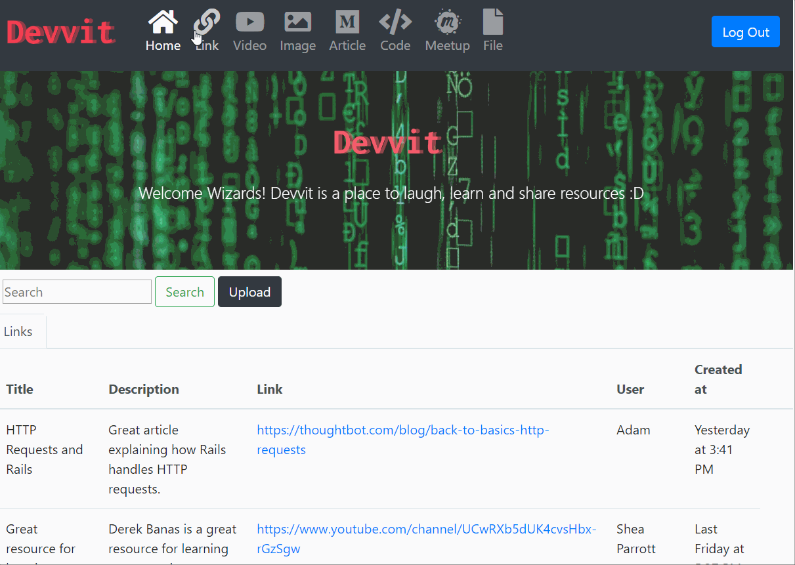

# Devvit  


- Developer's Directory
- Devvit is named after 'Reddit' for Developers 
- Massive data de-clustering solution for developers




> Keep Calm and Share Your Data!


## Why Devvit :+1:


_Sharing Information_ is a great practice of developers. Throughout immersive code school, I have been shared of a great amount of resourceful materials in different types of data via Slack. However, searching for the previous information was always a hassle especially when the information was shared a while ago. In order to solve this clustered data problem and to save our data more practially and efficiently, I have developed this app with clearly-distinguished categories using with subjective org. schema.


### Tech/framework used


<b>Built with</b>

- [REACT](https://reactjs.org/) Framework
- [PostgreSql](https://www.postgresql.org/) Object-relational database management system 
- [RUBY](https://www.ruby-lang.org) Back-end Language


### Code Example

```ruby
const imageFormSchemaFunction = image => {
  return {
    title: 'Image',
    type: 'object',
    required: ['url', 'description'],
    properties: {
    url: { type: 'string', title: 'Url', default: image.url },
    description: {
    type: 'string',
    title: 'Description',
    default: image.description
        }
      }
   }
}

  return (
    <Edit
      history={this.props.history}
      modelName="image"
      apiGetURL={`/api/images/${this.props.match.params.id}`}
      apiPutURL={`/api/images/${this.props.match.params.id}`}
      afterSubmitRoute={'/image'}
      formSchemaFunction={imageFormSchemaFunction}
    />
  )
```

### Task Lists

- [x] DRY the code
- [x] Post, Edit, Delete, Search functionalties 
- [ ] Show a message when a user is logged on 'Welcome, (user_name)!'
- [ ] Activate the rest of pages (Article, Meetup, Code, File)


### License

SDG © MIRA KANG
